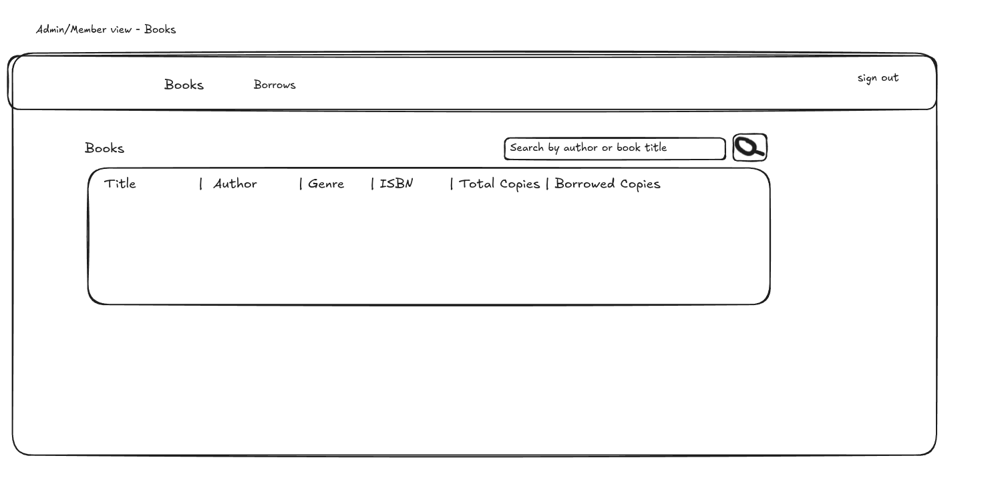
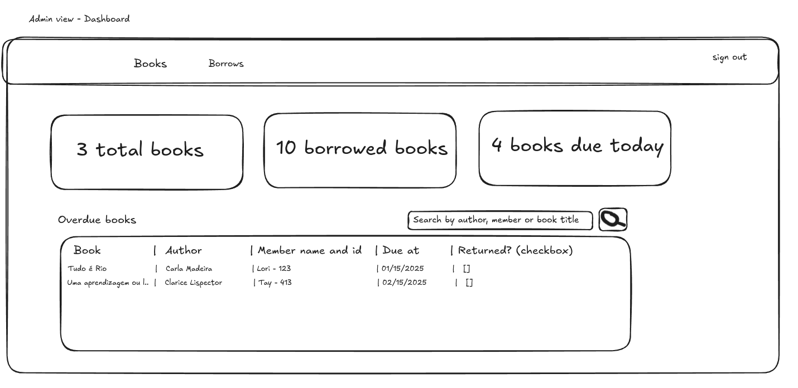
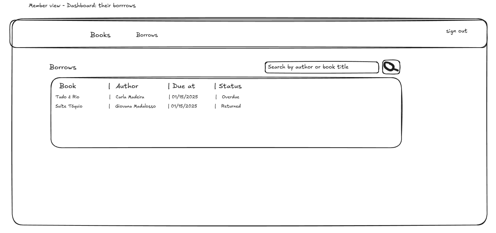
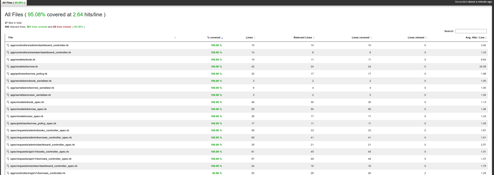

# README

The setups steps expect following tools installed on the system.

- Ruby 3.3.3
- Rails 7.2.2.1

# Thought Process

The first thing I did was initiate the project with `rails new ballast_library --database=postgresql`

Then, I thought about the libraries I might have to use to make the project easier:

1. Pundit for custom permissions
2. devise for user authentication
3. ransack to make the searching easier

**Since the project is due to 48 hours, I chose to make a simple front-end first and then create a React front-end only if I have time, because it takes longer to create components.**

So I'll start by thinking the basic database entities:

- User: email, password
- Book: title, author, genre, ISBN, total_copies (default 0), all of them must not be null
- Borrow: returned (bool, def false) user_id due_to (besides the default timestamps like created at and updated at)

Before anything else, I'll make my initial git commit so that I ensure my project is safe.

## Authentication

First, I'll install devise and create users. I followed the [docs](https://github.com/heartcombo/devise) steps to installation and generated their views.

I changed the default migration so that the `User` table would also have a role, which I plan to be an `enum`: `t.integer :role, null: false, default: 0`

## Basic Dashboard

I created admin -> dashboardcontroller and member -> dashboardcontroller, each with an `index` action only, just to render the initial views and set the after sign in path for each of the roles.

## Basic page layout

Using a very basic drawing software called [Excalidraw](https://excalidraw.com/), I designed what the dashboard should look like before coding.





## Frontend

After I decided  how the frontend would be, I tried installing a library that would allow me to use react on ruby on rails, but it didn't work, so I started using a bootstrap template.

## Routes

To make basic permissions easier, I made the application have 2 main namespaces, `/admin` and `/member` and each role would only have aacess to their own namespace.

I started by the `/admin` pages, with the books and borrows pages and tables, and then creating the main dashboard.

During the process, I already installed `ransack` so that it could be used on the pages' searching.

I then started working on the sign in and sign up pages and improved general responsiveness.

## Rspec Tests

While I created the models and pages, I created their own Rspec tests (`model` and `requests` specs, specifically), so that I could make sure everything was working well without having to repeat all of the processes and test cases myself. I also installed `Simplecov` to check for the tests' coverage. I also installed `factorybot` and `rails-controller-testing` to test contorller instance variables.

At the end, it was possible to archieve a 95% test coverage:



# API

I created the API under `api/v1` and it has a `BaseController` where is requires dookeeper authentication and rescues some of the errors with specific returned status codes, like the `Pundit::NotAuthorizedError`. I also defined `current_user` so that I could use it from their `doorkeeper_token`.

## Authentication

To authenticate, I'm using doorkeeper with credentials.
```shell
=> 
#<Doorkeeper::Application:0x0000750eed58fa18
 id: 1,
 name: "Doorkeeper Test",
 uid: "2wjaLjb9L3-yoc42_K3BZEOMVHzUfYNGmBadkT3ISw0",
 secret: "[FILTERED]",
 redirect_uri: "urn:ietf:wg:oauth:2.0:oob",
 scopes: "",
 confidential: false,
 created_at: "2025-01-18 02:58:55.944370000 +0000",
 updated_at: "2025-01-18 02:58:55.944370000 +0000">
ballast-library(dev)> 
```

After creating, just get the appication uid:

```shell
ballast-library(dev)> a.uid
=> "2wjaLjb9L3-yoc42_K3BZEOMVHzUfYNGmBadkT3ISw0"
ballast-library(dev)> 
```

it can be used to generate a dookeeper Bearer token that allows the application to know who is requesting (there are some default users on `seeds.rb`):

```json
{
    "grant_type": "password",
    "email": "member@member.com",
    "password": "qwe123",
    "client_id": "2wjaLjb9L3-yoc42_K3BZEOMVHzUfYNGmBadkT3ISw0"
}
```

# Policies/Permissions

Both for the API and the main member application, I created a `BorrowPolicy` with a scope defined so that members could only see their own borrows and could not perform any write or destroy actions. THe one ones who can are librarians, who also can see anyone's borrows.

# How to run this application

1. Install dependencies

ruby 3.3.3

2. clone the repo and run `bundle install` inside the application folder

3. run `rails db:create db:migrate db:seed`

4. run tests with `bundle exec rspec`

5. create server with `rails s` on the terminal

6. To test the API, get the credentials from `seeds` and get the Doorkeeper Application UID from rails console or directly from the database and follow the steps on "Api -> Authentication"

7. To test the general frontend, just visit `http://localhost:3000/`

# Next steps

Since it's a test application I didn't feel the need to add pagination, but it would be better for optimization.

A simple React front-end would be easy to make with pre-made templates like MUI.
